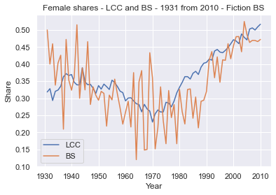
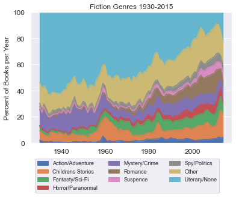

# RA Juhn Authors Project

This repository contains projects related to research assistant work for Professor Chinhui Juhn at the University of Houston - Department of Economics

## Description

Authors with a book on the New York Times Best Seller list are top performers in the publishing industry. Recently, bestselling authors are one of the few high-profile professions with gender parity. Most other high earning or top performing careers are male dominated (CEOs, lawyers, surgeons, etc.) thus achieving gender parity in among the top one percent of a labor market is a rare phenomenon. Additionally, the gender composition of authors whose books were accepted into the United States Library of Congress under the fiction genre reached gender parity around 2008. 

While much research has been done on the gender wage gap, understanding the gender publishing gap as well as what makes best-selling authors unique is critical to understanding other disparities in the labor force. Our research examines the gender publishing gap among authors with a book on the New York Times Best Seller list (1931-2018) as well as among authors with a published work accepted into the United States Library of Congress (1900-2015). We study this labor market to understand what factors have contributed to women’s success.

   

    

## Getting Started

### Dependencies

* All code was written in python 3 

## Authors

* Jordan Holbrook - jcholbrook@uh.edu
* Angelo Santos - afdossan@CougarNet.UH.EDU

## Version History

* 0.1
    * Initial Release

## Acknowledgments

Inspiration, code snippets, etc.
* [awesome-readme](https://github.com/matiassingers/awesome-readme)
* [PurpleBooth](https://gist.github.com/PurpleBooth/109311bb0361f32d87a2)
* [dbader](https://github.com/dbader/readme-template)
* [zenorocha](https://gist.github.com/zenorocha/4526327)
* [fvcproductions](https://gist.github.com/fvcproductions/1bfc2d4aecb01a834b46)
